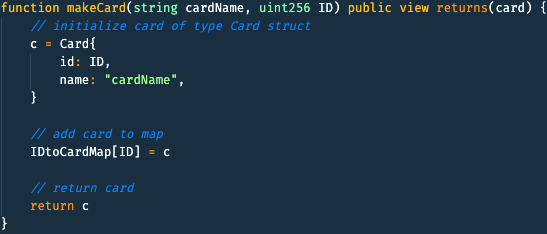
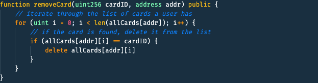
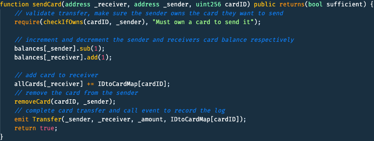
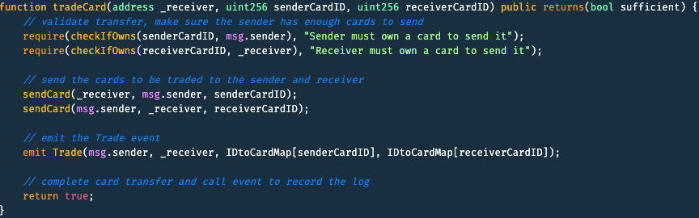
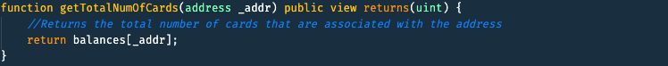
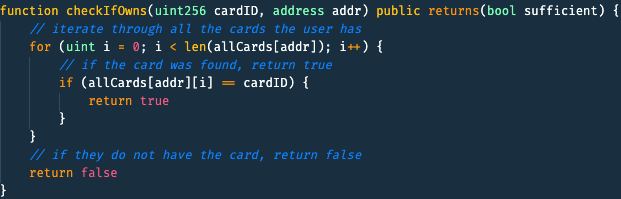

# MakeCards 
> An Ethereum cryptocurrency based on code using a trading card game model

A commemoration for the students of a silly little coding school.

# Code Base
### Creating Cards

### Removing Cards
 
### Gifting Cards

### Trading Cards

### Total Cards

### Checking if card is owned

# Specifics
## Cards
For example we can have a common card that represents a (fictitious) student named Momar Magoo [beginner]  with the abilities “Can Print ‘Hello World’”, which could be used in battle. 

If the card wins in a battle, or is upgraded, can become Momar Magoo [advanced] with the abilities “Efficient Concurrent operations”

## Trading
Users will be able to trade the cards they have with other users to get cards that they want to build a stronger team. 

For example, Max can trade 10 Braus cards for one Dani card from Ninja to build a god-tier team

## Gifting / Sending cards
Users can also gift cards to other users to help them get started!

For Example, Ninja can gift one Ben Lafferty card to Gary to help him build a strong Back End team.

## Rarity
To maintain rarity, users won’t be able to make their own cards. The cards would be added in as new students come to the school, and will be able to gain currency to buy packs through (good) git commits. They will also start with one copy of their own card.
There will be a starting amount of 50 common cards, 30 uncommon cards, 10 rare cards, and 5 legendary cards for each student.
Ex. When Jack Black enrolls at make school, there will be 50 Jack Black [beginner] cards that are created. When he finishes his first BEW track course, 30 Jack Black [Intermediate] will be created. When he graduates, there will be 5 Jack Black [Legendary] cards created!

# MISC
## How We Worked
In spite of quaritine we decided to work together as much as possible, so we opted into doing most of our work in live code; hence, the reason the commit's are lobsided to one person due peer coding.
## Team Members
<table>
  <tr>
    <td align="center">
      <a href="https://github.com/HexSeal">
        
         
        
          <b>Max Finn</b>
        
      </a>
       
    </td>
    <td align="center">
      <a href="https://github.com/NinjaAung">
         
        
          <b>Nyein Chan Aung</b>
        
      </a>
       
    </td>
    <td align="center"><a href="https://github.com/OmarSagoo">
      
       
      
        <b>Omar Sagoo</b>
      </a>
       
    </td>
    </tr>  
</table>

